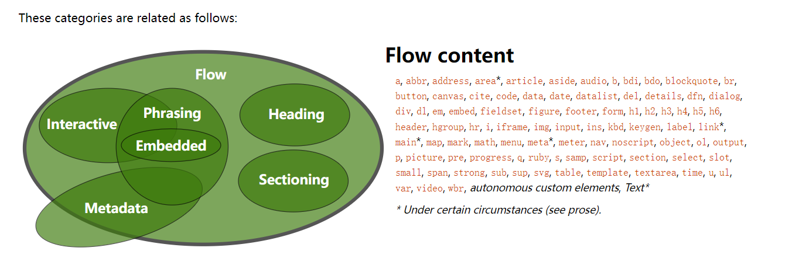

## 说明
[参考HTML5文档](https://html.spec.whatwg.org/)
>课程内容包括：
一 HTML和CSS基础知识
* HTML元素的分类和特性
* HTML元素默认样式和定制化
* CSS选择器全解析
* CSS常见属性逐一讲解
二CSS布局实战
* 布局属性和组合解析
* 常见布局方案介绍
* 三栏布局案例
* 国内产品布局方案
三动画和效果专题讲解
* 多背景多投影特效
* 3D特效编写实践
* 过渡动画和关键帧动画实践
* 动画细节和原理深入解析
四框架集成和CSS工程化
* 预处理器作用和原理
* Less/Sass代码实践
* Bootstrap原理和用法
* CSS工程化实践方式
* JS框架中的CSS集成实践

# 一、HTML和CSS基础知识

## 1、HTML常见元素和理解
分为：head body
* meta
* title
* style
* link
* script
* base
> • <meta charset="utf-8">
> • <meta name="viewport" content="width=device-width, initial-scale=1.0, maximum-scale=1.0, user-scalable=no">
> • <base href="/">
* div/section/acticle/aside/header/footer
* P
* span/em/strong
* table/thead/tbody/tr/td
* ul/ol/li/dl/dt/dd
* a
* form/input/select/textarea/button

>• a[href,target]
>• img[src,alt]
>• table td[colspan,rowspan]
>• form[target, method, enctype]
>• input[type,value]
>• button[type]
>• select>option[value]
>• label[for]

[生成HTML大纲算法工具](http://h5o.github.io/)
## 2、HTML版本
* HTML4/4.01(SGML)
* XHTML(XML)
* HTML5
## 3、HTML元素的分类
* 按默认样式分类——块级block 行内inline inline-block 
* [按内容分](https://html.spec.whatwg.org/multipage/dom.html#documents)
 

## 4、HTML元素嵌套关系
* 块级元素可以包含行内元素
* 块级元素不一定能包含块级元素 例如 p不可以包含div
* 行内元素一般不能包含块级元素
* 但是 。。。。 什么叫一般 例如 a包含div是合法的？不一定是合法的取决于外面元素，因为a是 Transparent, 是透明元素在浏览器解析时是会忽略掉的所以要看div前面的元素是什么，如果是div或者body的话那就是合法的如果是P那就是不合法的浏览器解析时，就不会解析浏览器的容错机制会把div单独拿出来在进行解析 
* content model 
## 5、HTML元素默认样式和定制化
* 默认样式的意义
* 默认样式带来的问题
* CSS Reset 样式重置——YUI(样式归零，适配各个浏览器)， Normalize(保留一些原有margin,padding并且去做一些修正！)
简单有效的CSS Reset,不过比较有争议，因为使用*会不会影响性能，基本上是不会影响性能问题；
*{
    margin:0;
    padding:0;
}
## 6、HTML面试真题解答
* 1、doctype的意义是什么？让浏览器以标准模式渲染；让浏览器知道元素的合法性；
* 2、HTML xHTML HTML5的关系？ HTML属于SGML;XHTML属于XML，是HTML进行XML严格化的结果 HTML5不属于SGML或者XML,比XHTML宽松
* 3.HTML5有什么变化？新的语义化的元素和变化；表单增强；新的API(离线、音视频、图形、实时通信、本地存储、设备能力)；分类和嵌套变更；
* 4、em和i有什么区别？em是语义化的标签，表强调；i是纯样式的标签，表斜体；HTML5中i不推荐使用，一般用作图标；
* 5、语义化的意义是什么？开发者更容易理解；机器容易理解结构（搜索、读屏软件）；有助于SEO;semantic microdata
* 6、哪些元素可以自闭合？ input img br hr meta link 
* 7、HTML和DOM的关系？HTML是死的；DOM由HTML解析而来的是活的；JS可以维护DOM;
* 8、property(特性)和attribute（属性）的区别？attribute是死的；property是活的；两者的改变不会对对方有影响；
* 9、form的作用有哪些？直接提交表单；使用submit/reset按钮；便于浏览器保存表单；第三方库可以整体提取值；第三方库可以进行表单验证；

# 二、CSS基础
Cascading Style Sheet 层叠样式表；
## 1、选择器
